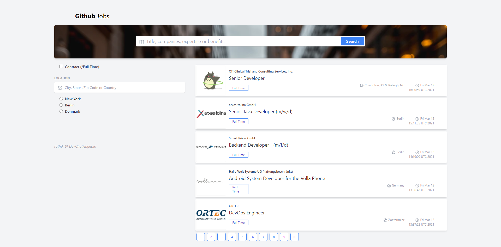
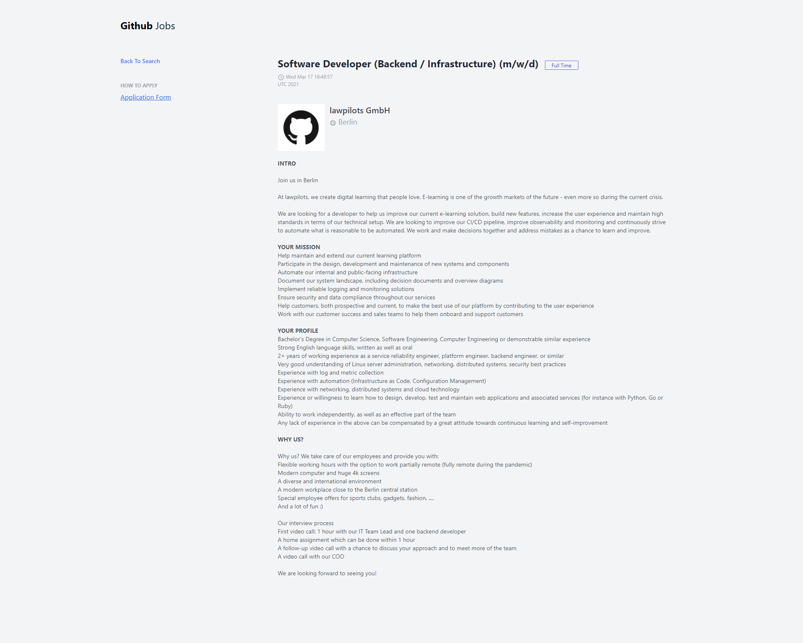

<!-- Please update value in the {}  -->

<h1>Github Jobs</h1>

<div>
   Solution for a challenge from  <a href="http://devchallenges.io" target="_blank">Devchallenges.io</a>.
</div>

<div>
  <h3>
    <a href="">
      Demo
    </a>
    <span> | </span>
    <a href="">
      Solution
    </a>
    <span> | </span>
    <a href="https://devchallenges.io/challenges/TtUjDt19eIHxNQ4n5jps">
      Challenge
    </a>
  </h3>

## Overview




### Built With

<!-- This section should list any major frameworks that you built your project using. Here are a few examples.-->

- [Vue](https://vuejs.org/)
- [Vite](https://github.com/vitejs/vite/)
- [Tailwind](https://tailwindcss.com/)

## Features

<!-- List the features of your application or follow the template. Don't share the figma file here :) -->

This application/site was created as a submission to a [DevChallenges](https://devchallenges.io/) challenge. The [challenge](https://devchallenges.io/challenges/TtUjDt19eIHxNQ4n5jps) was to build an application to complete the given user stories.

## How To Use

<!-- Example: -->

To clone and run this application, you'll need [Git](https://git-scm.com) and [Node.js](https://nodejs.org/en/download/) (which comes with [npm](http://npmjs.com)) installed on your computer. From your command line:

```bash
# Clone this repository
$ git clone https://github.com/mdrathik/githubjobs

#Change Directory
cd githubjobs

# Install dependencies
$ npm install

# Run the app
$ npm dev run
```

## Contact

- Website [rathik.dev](https://rathik.dev)
- GitHub [mdrathik](https://github.com/mdrathik)
